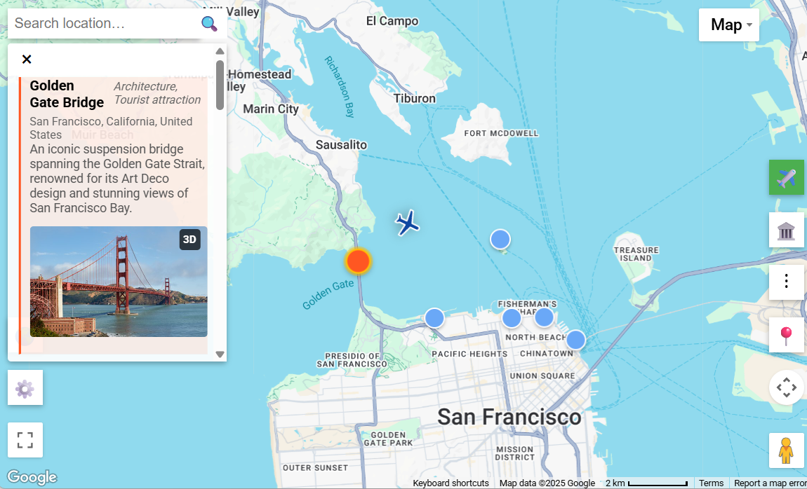
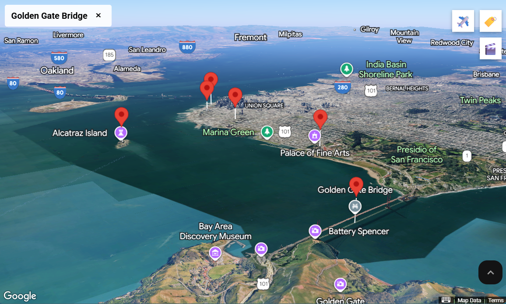

# Mini Moving Map

A minimalist Google Maps application with AI-powered landmark discovery and 3D exploration experience.

## Features

- **New addition**: Search Nearby airports, Search Internet Radio stations
- **Moving Map**: MSFS (Microsoft Flight Simulator) integration for aircraft marker tracking effect
- **Landmark Discovery**: Google Places nearby search + OpenAI landmark query + Wikipedia images
- **Location Search**: Google Places text search + OpenAI location query + User Geolocation
- **Photorealistic 3D Maps**: Google Earth-style 3D navigation + Cinematic flyovers for each landmarks
- **World ready**: Automatically adapts LLM content and UI translation to browser's language setting

### Technical Highlights

- **Frontend:** Map integration, landmark visualization, location navigation, browser-side caching and test runner
- **Backend:** Flask API connecting to MSFS via SimConnect proxy to fetch real-time aircraft telemetry
- **LLM:** OpenAI selects landmarks from Google results, generates descriptions, adapts language to location
- **Caching:** Proximity-based keys with coordinate rounding + location matching + TTL expiration
- **Auto Translation:** Support JSON resource, string changes detection, local TM (Translation Memory), secondary locale for multi-lingual users
- **Configuration:** Map defaults, test mode mock data on `config.json`, LLM prompt templates on `prompts.js`

### External Services

- **Google Maps API**: Core mapping functionality with 3D support
- **Google Places API**: Location search and nearby places discovery
- **OpenAI API**: LLM generated translations and landmark information
- **Wikipedia API**: Landmark and location photos

### Vanilla JavaScript Frontend with Vite

```
src/
├── app.js          # Init Google Maps application
├── search.js       # Location and landmark search
├── landmark.js     # Landmark display, markers, and 3D overlays
├── gmap.js         # Google Maps API wrappers
├── openai.js       # OpenAI prompting
├── prompts.js      # LLM Prompt templates
├── lion.js         # i18n/L10n with auto-translations
├── cache.js        # On-browser localStorage caching
├── components.js   # reusable UI components
├── simconnect.js   # connect to MSFS via SimConnect
└── test_runner.js  # Client-side testing
```

## Getting Started

**Prerequisites**

- Install Node.js (https://nodejs.org/).
- Clone this repository and install dependencies (see `package.json`)

```bash
git clone <repository-url>
cd <my-project>
npm install
```

**Create environment file**

Create your own `.env` file and add your API keys for local development. Vite exposes variables prefixed with `VITE_` to the browser app

```bash
VITE_GOOGLE_MAPS_API_KEY=your_google_maps_api_key
VITE_OPENAI_API_KEY=your_openai_api_key
```

### "Bring your own key" approach

As an open-source project targeting technical users, this client-only web-app is designed to run on user's keys. The user is responsible for:

1.  Creating their own Google Cloud project Maps API key (required), and OpenAI API key (optional)
2.  Securing their key by restricting it to their own domains (`localhost` for testing, their deployment domain for production).
3.  The costs associated with their usage, respecting Google Maps and OpenAI terms of service.

**Generate API keys**

- **Google Maps API Key**

  1.  Visit the [Google Cloud Console](https://console.cloud.google.com/) → Create or select a project → Go to [Google Maps Platform](https://console.cloud.google.com/google/maps-apis) ([See Also](https://developers.google.com/maps/documentation/javascript/get-api-key)).
  2.  Enable “Map Tiles API”, “Maps JavaScript API”, “Geocoding API” and “Places API (New)” under **APIs & Services**.
  3.  Create an API key under **Keys & Credentials**. For local development restrict **HTTP referrer** to `localhost`.

- **OpenAI API Key**
  1.  Visit the [OpenAI dashboard](https://platform.openai.com/api-keys).
  2.  Create a new secret key and copy it for later use; it won't be shown again.

**Start Vite development server**

```bash
npm run dev
```

**Enter API keys in the app**

- Open `http://localhost:5001` in your browser.
- Click the gear icon (**⚙️ Settings UI**) in the bottom‑left corner.
- Fill in `GOOGLE_MAPS_API_KEY` and `OPENAI_API_KEY`, then close to save.
- Settings are stored in `localStorage` under `APP_SETTINGS`.
- In Chrome, view them under DevTools → Application → Local Storage; landmark caches use keys starting with `landmark_`.

**Start server proxy for MSFS "moving map"**

- Install Python with UV and dependencies (see `pyproject.toml`)
- Relies on the [Python‑SimConnect](https://github.com/odwdinc/Python-SimConnect) library
- Install and run it alongside with MSFS on the same PC

```bash
uv pip install .
python server.py
```

## Usage

- Pan and zoom the Google map. Use **🔍 Location Search** to search a city or place.
- Click **🏛️ Landmarks** to discover nearby points of interest around the map center.
- Select a landmark card to read the AI-generated description and see a Wiki photo.
- Click **[3D]** on landmark cards to explore with a photorealistic 3D map view.
- Use **📍 My Location** to center the map at current geolocation per browser detection.
- Open the gear icon (**⚙️ Settings**) to update API keys or clear stored values.
- Use **🌐 Locale** to toggle between multiple preferred locales per browser setting.
- Click **aircraft ✈️** icon to sync aircraft position when connected to MSFS.

### Testing

- Frontend Test Runner - standalone test script running direct function testing
- Built-in test mode with mock data from config.json, skipping API calls
- Runnable on both browser console and Node.js CLI via `npm test`
- Append `?test=true` to the URL to auto-run tests on-browser

### Q&A
You can ask a LLM to read this source code and answer most questions about this project.  For example, try pasting these prompts directly into ChatGPT:
- In the GitHub public repo `cozymos/mini-moving-map`, can you show me how to install and run it on the same PC that runs MSFS, starting with step-by-step how to generate a Google API key.
- The README of cozymos/mini-moving-map is too complex.  Please describe, in simple steps in plain language, how a non-technical person can open and use the app on an Oculus headset.  Ask me questions to help fill gaps.
- Review the source code of https://github.com/cozymos/mini-moving-map — is it safe to enter my OpenAI API key in the browser?  Does the repo send my API keys anywhere?

## Screenshots



