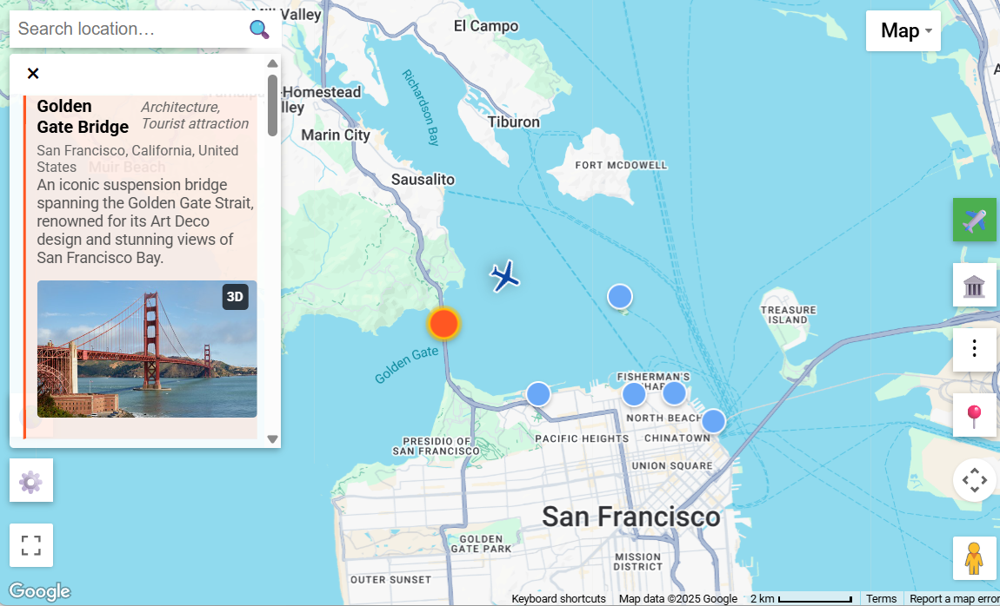
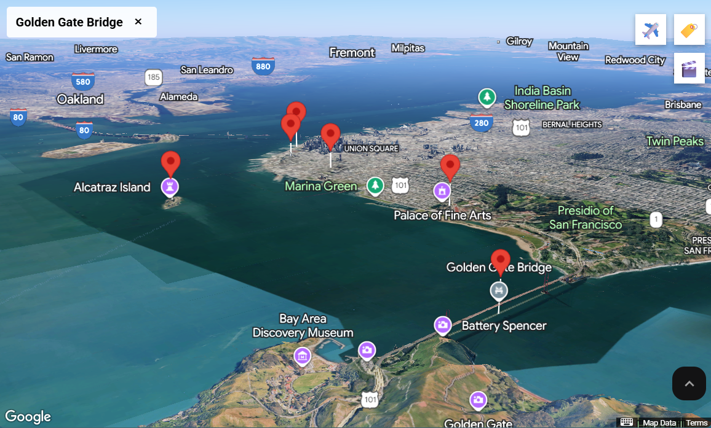

# Mini Moving Map

A minimalist Google Maps app with AI-powered landmark discovery and 3D exploration experience.

## Features

- **Moving Map**: MSFS (Microsoft Flight Simulator) integration for aircraft marker tracking effect
- **Landmark Discovery**: Google Places nearby search + LLM landmark query + Wikipedia images
- **Location Search**: Google Places text search + LLM location query + User Geolocation
- **Photorealistic 3D Maps**: Google Earth-style 3D navigation + Cinematic flyovers for each landmarks
- **World ready**: Automatically adapts content locale and UI translation to browser's language setting

### Technical Highlights

- **Standalone client:** browser-side Javascript Map frontend, landmark visualization, location navigation
- **Flask runtime:** optional Python API backend to serve landmarks with server-side LLM prompting & caching
- **Streamlit runtime:** alternate UI that shares the same Python backend services as the Flask runtime
- **Moving Map:** Flask API connecting to MSFS via SimConnect proxy to fetch real-time aircraft telemetry
- **LLM:** selects landmarks from Google results, generates descriptions, adapts language to location
- **Caching:** Proximity-based keys with coordinate rounding + location matching + TTL expiration
- **Auto Translation:** Support JSON resource, string changes detection, local TM (Translation Memory), secondary locale for multi-lingual users
- **Configuration:** Map defaults, test mode mock data on `config.json`, LLM prompt templates on `prompts.js`

### External Services

- **Google Maps API**: Core mapping functionality with 3D support
- **Google Places API**: Location search and nearby places discovery
- **OpenAI API**: LLM generated translations and landmark information
- **Gemini API**: Gemini LLM grounded with Google Maps
- **Wikipedia API**: Landmark and location photos

### Vite SPA Frontend

```
src/
├── app.js          # Vanilla Javascript app based on Google Maps SDK
├── search.js       # Location, landmark search and display
├── landmark.js     # Landmark sidebar, markers, and 3D overlays
├── gmap.js         # Google Maps API wrappers
├── gemini.js       # Gemini LLM grounded with Google Maps
├── openai.js       # OpenAI LLM via OpenAI-compatible API
├── prompts.js      # LLM Prompt templates used by frontend
├── lion.js         # i18n/L10n with auto-translations
├── cache.js        # On-browser localStorage caching
├── components.js   # reusable UI components
├── simconnect.js   # connect to MSFS via SimConnect
└── test_runner.js  # Client-side testing
```

### Flask API Endpoints

- **Landmark Search:** `/api/landmark/search` - landmark descriptions and Wiki URLs
- **Images:** `/api/landmark/image/{landmark_name}` - cached thumbnails from Wikipedia
- **Geocoding:** `/api/landmark/geocode` - Google Forward/reverse geocoding
- **Configuration:** `/api/map/config` - default settings and test mode data
- **SimConnect integration:** `/api/simconnect/<status>` - MSFS telemetry

### Optional Backend

```
project/
├── src/                     # Contains the SPA Web app
├── index.html               # Frontend shell entrypoint (Vite root)
├── public/                  # Static configuration files
│   ├── config.json          # Map defaults and test fixtures
│   ├── app-config.js        # local vs remote runtime config
│   └── prompts.toml         # LLM Prompt templates used by backend
├── services/
│   ├── landmark_service.py  # Landmark discovery and data aggregation
│   ├── location_service.py  # Location search via Places & Geocoding API
│   ├── llm_service.py       # LLM API prompting with intelligent selection
│   └── image_service.py     # Wikipedia image fetching and caching
├── components/
│   ├── endpoints.py         # Flask blueprint with REST API routes
│   ├── cache_manager.py     # Multi-tier caches with JSON file store
│   ├── map_viewer.py        # Folium-based interactive map rendering
│   └── sidebar.py           # Streamlit sidebar controls and debug panel
├── utils/
│   ├── config_utils.py      # Config, logger and test mode utilities
│   ├── coord_utils.py       # Coordinate parsing and manipulation
│   └── prompt_utils.py      # TOML-based prompt template management
├── tests/                   # Standalone test scripts
│   └── test_runner1.py      # Quick Test runner for regression
├── pyproject.toml           # Project metadata and dependencies
├── app.py                   # Flask server backend entrypoint
├── simconnect_app.py        # SimConnect-only Flask entrypoint
├── main.py                  # Streamlit application entrypoint
├── run.py                   # unified launcher for different runtime
└── README.md                # This file
```

## Getting Started

**Prerequisites**

- Install Node.js (https://nodejs.org/)
- Install Python with UV and dependencies (see `pyproject.toml`)
- Clone this repository and install dependencies (see `package.json`)

```bash
git clone <repository-url>
cd <my-project>
npm install
uv pip install .
```

**Start local runtime with client-only Web app**

- Start Vite with `npm run dev`
- Open `http://localhost:5001`
- Enter API keys through the in-app Settings UI

### Configure your own API Keys

**Google Maps API Key**
  1.  Visit the [Google Cloud Console](https://console.cloud.google.com/) → Create or select a project → Go to [Google Maps Platform](https://console.cloud.google.com/google/maps-apis) ([See Also](https://developers.google.com/maps/documentation/javascript/get-api-key)).
  2.  Enable “Map Tiles API”, “Maps JavaScript API”, “Geocoding API” and “Places API (New)” under **APIs & Services**.
  3.  Create an API key under **Keys & Credentials**. For local development restrict **HTTP referrer** to `localhost`.

**Enter API keys in the settings dialog**

- Open `http://localhost:5001` in your browser.  Click the gear icon (⚙️).
- Fill in `GOOGLE_MAPS_API_KEY` and `OPENAI_API_KEY`, then close to save.
- Fill in optional `GEMINI_API_KEY` for LLM search grounded with Google Maps
- Settings are stored in browser local storage
- For development, Vite exposes variables prefixed with `VITE_` to the Web app

```bash
VITE_GOOGLE_MAPS_API_KEY=your_google_maps_api_key
VITE_OPENAI_API_KEY=your_openai_api_key
VITE_GEMINI_API_KEY=your_gemini_api_key
```

**Start SimConnect-only server for MSFS "moving map"**

- Install Python with UV and dependencies (see `pyproject.toml`)
- Relies on the [Python‑SimConnect](https://github.com/odwdinc/Python-SimConnect) library
- Install and run the SimConnect app alongside with MSFS on the same PC
- SimConnect backend starts tracking and syncing aircraft position to the frontend
- Vite runs on `http://localhost:5001` and proxies `/api` requests to `http://localhost:5000`

```bash
uv pip install .
python run.py --simconnect-only
```

**Start the Flask runtime**

```bash
# Expose API keys using environment variables
export GOOGLE_MAPS_API_KEY="your-google-maps-key"
export OPENAI_API_KEY="your-openai-key"
export GEMINI_API_KEY="your-gemini-key"   # Optional

# Flask API + source-served frontend
python run.py --flask
```

**Start the Streamlit runtime**

```bash
# Streamlit with debug logging
python run.py --streamlit --debug
```

## Usage

- Pan and zoom the Google map. Use **🔍 Location Search** to search a city or place.
- Click **🏛️ Landmarks** to discover nearby points of interest around the map center.
- Select a landmark card to read the AI-generated description and see a Wiki photo.
- Click **[3D]** on landmark cards to explore with a photorealistic 3D map view.
- Use **⋮ > Find my location** to center the map at current geolocation per browser detection.
- Open the gear icon (**⚙️ Settings**) to update API keys or clear stored values.
- Use **🌐 Locale** to toggle between multiple preferred locales per browser setting.
- Click **aircraft ✈️** icon to sync aircraft position when connected to MSFS.

### Testing

- Frontend Test Runner - standalone test script running direct function testing
- Built-in test mode with mock data from config.json, skipping API calls
- Runnable on both browser console and Node.js CLI via `npm test`
- Append `?test` to the URL to auto-run tests on-browser
- Backend test runners are under `tests/`.  Run the Python test set directly.

### Q&A
You can ask a LLM to read this source code and answer most questions about this project.  For example, try pasting these prompts directly into ChatGPT:
- In the GitHub public repo `cozymos/mini-moving-map`, can you show me how to install and run it on the same PC that runs MSFS, starting with step-by-step how to generate a Google API key.
- The README of cozymos/mini-moving-map is too complex.  Please describe, in simple steps in plain language, how a non-technical person can open and use the app on an Oculus headset.  Ask me questions to help fill gaps.
- Review the source code of https://github.com/cozymos/mini-moving-map — is it safe to enter my OpenAI API key in the browser?  Does the repo send my API keys anywhere?

## Screenshots



